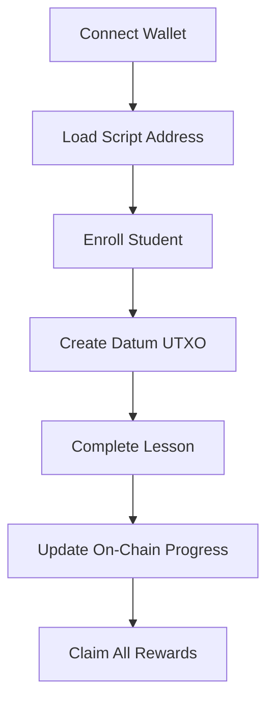

# 🎓 EduFi Learn-to-Earn Smart Contract & dApp Documentation

**EduFi** is a blockchain-based *Learn-to-Earn* platform built on **Cardano**, enabling students to earn ADA rewards as they complete lessons verified on-chain.

It integrates **Lucid.js**, **Plutus V2**, and **Blockfrost API** to combine blockchain validation with a smooth frontend user experience.

---

## 📚 Table of Contents

1. [📦 Overview](#1-overview)
2. [🧱 Core Architecture](#2-core-architecture)
3. [🗃️ Data Structures](#3-data-structures)
4. [🔐 Redeemers](#4-redeemers)
5. [⚙️ Smart Contract Workflow](#5-smart-contract-workflow)
6. [🧠 Frontend Logic Explained](#6-frontend-logic-explained)
7. [🌐 Blockchain Interaction Flow](#7-blockchain-interaction-flow)
8. [💡 Example Usage](#8-example-usage)
9. [🧪 Testing Recommendations](#9-testing-recommendations)
10. [✅ Best Practices](#10-best-practices)
11. [📘 Glossary of Terms](#11-glossary-of-terms)

---

## 1. 📦 Overview

EduFi is a **Learn-to-Earn decentralized education system** that rewards students for learning blockchain concepts or any course linked via IPFS.

### ✨ Features
- Free or staked enrollment for students.
- On-chain progress tracking using **UTXO-based state**.
- ADA rewards for each lesson completed.
- Secure withdrawals enforced by **Plutus validators**.
- Low gas fees and Cardano-native security.

---

## 2. 🧱 Core Architecture

EduFi is powered by **Lucid.js** (frontend SDK) and **Plutus V2** (on-chain validator).

```js
const BLOCKFROST_URL = "https://cardano-preprod.blockfrost.io/api/v0";
const BLOCKFROST_KEY = "<YOUR_BLOCKFROST_KEY>";
const NETWORK = "Preprod";
````

### 🧩 Components

| Layer                     | Role                                                   |
| ------------------------- | ------------------------------------------------------ |
| **Frontend (Lucid.js)**   | Handles wallet connection, UI logic, and transactions. |
| **Plutus Smart Contract** | Enforces rules for staking, progress, and rewards.     |
| **Blockfrost API**        | Provides blockchain data and UTXO lookups.             |

---

## 3. 🗃️ Data Structures

### **EduDatum**

Defines the on-chain student state.

| Field             | Type                 | Description                               |
| ----------------- | -------------------- | ----------------------------------------- |
| `student`         | `PubKeyHash (Bytes)` | The student's wallet key hash.            |
| `stakeAmount`     | `Integer`            | Amount of ADA staked during enrollment.   |
| `lessonsDone`     | `Integer`            | Lessons completed so far.                 |
| `totalLessons`    | `Integer`            | Total number of lessons in the course.    |
| `rewardPerLesson` | `Integer`            | ADA reward (in lovelace) for each lesson. |
| `lessonNotes`     | `[Bytes]`            | Array of IPFS links for course materials. |

### Example:

```json
{
  "student": "0xabcdef1234...",
  "stakeAmount": 2000000,
  "lessonsDone": 3,
  "totalLessons": 10,
  "rewardPerLesson": 500000,
  "lessonNotes": ["ipfs://QmLesson1...", "ipfs://QmLesson2..."]
}
```

---

## 4. 🔐 Redeemers

EduFi defines three transaction actions through **redeemers**:

| Redeemer         | Constr Index | Action                                        |
| ---------------- | ------------ | --------------------------------------------- |
| `EnrollStudent`  | `Constr(0)`  | Register a new student.                       |
| `CompleteLesson` | `Constr(1)`  | Update progress on lesson completion.         |
| `ClaimAll`       | `Constr(2)`  | Withdraw all rewards after course completion. |

```js
const EnrollRedeemer = Data.to(new Constr(0, []));
const CompleteRedeemer = Data.to(new Constr(1, []));
const ClaimAllRedeemer = Data.to(new Constr(2, []));
```

---

## 5. ⚙️ Smart Contract Workflow

### 🔸 1. **Enrollment**

Creates a new UTXO at the script address with student data (`lessonsDone = 0`).

```js
const tx = await lucid
  .newTx()
  .payToContract(scriptAddress, { inline: datum }, { lovelace: stakeAda })
  .addSignerKey(pkh)
  .complete();
```

✅ **Result:** Student enrolled on-chain.

---

### 🔸 2. **Completing Lessons**

Updates progress by collecting and recreating the student's UTXO with `lessonsDone + 1`.

```js
const tx = await lucid
  .newTx()
  .collectFrom([studentUtxo], CompleteRedeemer)
  .attachSpendingValidator(script)
  .payToContract(scriptAddress, { inline: newDatum }, { lovelace: d.stakeAmount })
  .complete();
```

✅ **Result:** Lesson progress updated.

---

### 🔸 3. **Claiming Rewards**

After all lessons are completed (`lessonsDone == totalLessons`), the student withdraws rewards.

```js
const tx = await lucid
  .newTx()
  .collectFrom([studentUtxo], ClaimAllRedeemer)
  .attachSpendingValidator(script)
  .payToAddress(walletAddress, { lovelace: payout })
  .addSignerKey(pkh)
  .complete();
```

✅ **Result:** Rewards + staked ADA transferred to student’s wallet.

---

## 6. 🧠 Frontend Logic Explained

### 🧩 Wallet Initialization

Connects to the **Lace** wallet and fetches script UTXOs.

```js
const api = await window.cardano.lace.enable();
lucid.selectWallet(api);
walletAddress = await lucid.wallet.address();
scriptAddress = lucid.utils.validatorToAddress(script);
```

---

### 🧩 UI Functions

| Function             | Purpose                                |
| -------------------- | -------------------------------------- |
| `log(msg)`           | Prints transaction status or errors.   |
| `updateProgressUI()` | Updates progress bar visually.         |
| `updateLessonList()` | Lists lessons as clickable IPFS links. |

---

### 🧩 Notifications

Animated toast messages appear for enrollment, completion, and reward claiming events.

Example:

```js
notify("🎓 Enrollment successful!", "success");
```

---

## 7. 🌐 Blockchain Interaction Flow



---

## 8. 💡 Example Usage

| Action              | Description                     | Output                               |
| ------------------- | ------------------------------- | ------------------------------------ |
| **Enroll**          | Register as a student on-chain. | Creates new UTXO with initial datum. |
| **Complete Lesson** | Record lesson completion.       | Updates `lessonsDone`.               |
| **Claim Rewards**   | Withdraw ADA after all lessons. | Sends rewards to wallet.             |

---

## 9. 🧪 Testing Recommendations

### ✅ Preprod Test Steps

1. Fund a Lace wallet with test ADA.
2. Deploy validator to preprod.
3. Connect via your frontend and enroll.
4. Run through 10 lessons.
5. Claim total ADA rewards.

### ✅ Things to Test

* Enrollment works only once per wallet.
* Rewards can’t be claimed early.
* All transactions show on **Blockfrost Dashboard**.

---

## 10. ✅ Best Practices

* 🔒 Always require **student signature** for state updates.
* 💰 Double-check **rewardPerLesson** is fair and consistent.
* 🧾 Store lesson materials on **IPFS** for decentralization.
* ⚡ Use **inline datums** for faster lookups and readability.
* 🧪 Test thoroughly in **Preprod** before mainnet release.

---

## 11. 📘 Glossary of Terms

| Term              | Description                                              |
| ----------------- | -------------------------------------------------------- |
| **EduFi**         | Learn-to-Earn dApp for blockchain education.             |
| **Datum**         | On-chain record of a student's progress.                 |
| **Redeemer**      | Transaction type that defines user intent.               |
| **UTXO**          | Unspent Transaction Output — Cardano’s state model.      |
| **Lucid**         | JavaScript SDK for Cardano smart contract interaction.   |
| **Blockfrost**    | Blockchain API provider for Cardano.                     |
| **Inline Datum**  | Datum data stored directly in UTXO for quick validation. |
| **Plutus Script** | Smart contract logic enforcing state transitions.        |
| **CBOR**          | Binary encoding format for Plutus scripts.               |
| **Bech32**        | Readable blockchain address format.                      |

---

## 🧾 Summary

| Property               | Details                                  |
| ---------------------- | ---------------------------------------- |
| **Contract Type**      | Learn-to-Earn Smart Contract             |
| **Language**           | JavaScript (Lucid) + Plutus V2           |
| **Network**            | Cardano Preprod                          |
| **Reward Logic**       | On-chain deterministic reward per lesson |
| **Frontend Framework** | Lucid.js                                 |
| **Storage Model**      | UTXO-based persistent state              |

---

## 🎯 Developer Tip

> For deployment and testing, ensure:
>
> * You use a **valid Blockfrost project key**.
> * All IPFS links in `lessonNotes` are live.
> * Wallet supports **CIP-30** (e.g., Lace or Nami).

---

## 🧩 License

Open-source educational smart contract example under the **MIT License**.

---

**Author:** Teslim Lyon
**Frameworks Used:** Plutus V2, Lucid.js, Blockfrost API
**Network:** Cardano Testnet (Preprod)
**Version:** v1.0.0

```

---


